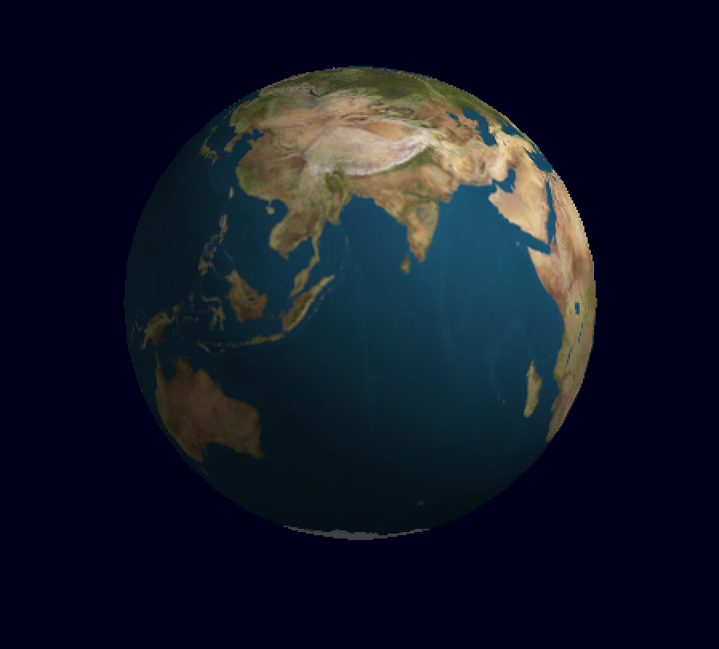
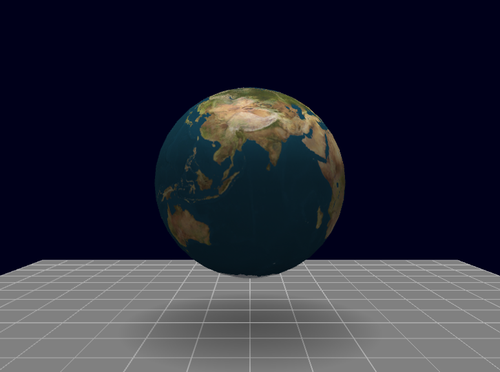

# 地球仪的绘制与交互实现 🌍  
**Computer Graphics Course Project**

---

## 一、项目简介

本项目是《计算机图形学》课程实验大作业，基于 **OpenGL** 实现一个可交互的三维地球仪模型。  
通过构建球体几何模型，并将世界地图纹理无缝映射到球体表面，实现了地球仪的三维可视化展示，同时支持旋转与缩放等交互操作。

该项目综合运用了 **三维建模、纹理映射、光照模型以及人机交互控制** 等计算机图形学核心技术，具有较强的实践与教学意义。

---

## 二、实验目标

- 使用 OpenGL 绘制三维球体模型  
- 将二维世界地图以纹理映射方式贴附到球体表面（无明显接缝）  
- 实现基本的光照与材质效果，增强立体感  
- 支持用户通过鼠标或触控方式对地球仪进行旋转与缩放  
- 熟悉 OpenGL 渲染流程及常见问题的调试方法  

---

## 三、运行环境

| 项目 | 说明 |
|---|---|
| 操作系统 | macOS / Windows / Linux |
| 编程语言 | C++ |
| 图形接口 | OpenGL 3.x |
| 窗口管理 | GLFW |
| 数学库 | GLM |
| 纹理加载 | stb_image |
| 开发工具 | VS Code / Xcode |

---

## 四、效果展示






---

## 五、操作说明

| 按键 | 功能 |
|----|----|
| +/- | 缩放地球 |
| R | 重置视角 |
| L | 切换光照开关 |
| S | 切换阴影开关 |
|【 | 减少阴影强度 |
| 】 | 增加阴影强度 |
| I | 当前光源信息 |
| 0-7键 | 选择特定光源位置 |
| N | 下一个光源位置 |
| P | 上一个光源位置 |
| ESC | 退出程序 |

## 六、运行方法

```bash
# 给予执行权限
chmod +x run.sh

# 运行脚本
./run.sh


